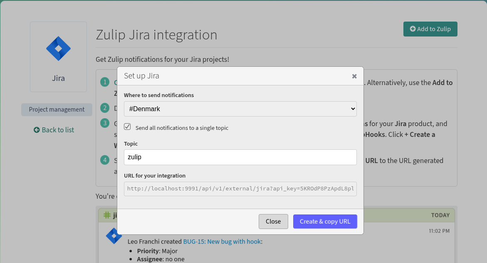

## A gist of the Problem Statement

Setting up **integrations** in Zulip can be a daunting process for non-technical users. They are redirected to the administration panel to manually create and configure bots.
Furthermore, the bot permission management lacks a user-friendly interface and a backend permissions system for managing bot permissions, making it difficult for users to grant integrations access to their Zulip data.

### Overview

What i understand based on the current state of the project of making integration easier for end users, many issues need serious discussions and decisions from the mentors and so the issues open are not directly implementable. For this proposal i tried to research and collect issues that are directly relevant to our end goal.
I would like to summarize the plan to make integrations accessible to non-technical users, into the following three categories:

1. **Backend Bot Permissions System:** This will cover the Design and implementation of backend permissions framework to manage and enforce what actions integration bots can perform.

2. **OAuth Authorization Flow:** Implement an OAuth system using the **Django OAuth Toolkit**. This will present a permission *authorization screen* to users when setting up an integration in order to provide better understanding to users of exactly what access they are granting.

3. **UI/UX Revamp for the `/integrations` Page:** We need to add intuitive buttons to directly create bots and add integrations, entirely removing the friction of navigating through the administration panel.


### Backend Bot Permissions System

**Problem:** Zulip's `INCOMING_WEBHOOK_BOT` type is documented as write-only, but this is never enforced at runtime. Once a bot has an API key, it can call any endpoint regardless of its type — a webhook bot could read messages it was never meant to access.

A new decorator in `zerver/decorator.py` will reject API requests from `INCOMING_WEBHOOK_BOT` on read endpoints, wired into the central dispatcher in `zerver/lib/rest.py` so the restriction applies consistently. The enforcement will be documented in the OpenAPI spec so integration developers understand the security boundary.

 **Relevant Issues**

- [#16431: Notify bot owners if bot tries to send to a channel it does not have access to](https://github.com/zulip/zulip/issues/16431)
- [#30077: Make name change permissions more flexible (groups-based permissions)](https://github.com/zulip/zulip/issues/30077)
- [#22405: Clearly document bot roles](https://github.com/zulip/zulip/issues/22405)
- [#13927: Make custom field viewing permissions configurable](https://github.com/zulip/zulip/issues/13927)

---

### OAuth Authorization Flow

**Problem:** Integrations authenticate with a static API key embedded in the webhook URL (`/api/v1/external/github?api_key=abc`). This has three gaps: the key grants broad access with no way to limit scope, revoking one integration means regenerating the key for every integration sharing that bot, and users never see or approve what the integration can do — the credential is silently issued.

**Current flow:** User clicks "Add to Zulip" → modal appears → `POST /json/integration_bots` → webhook URL with `?api_key=abc` returned. The API key in that URL has no scope limits — if it leaks or the service is compromised, it has the same access as the bot that owns it.

**OAuth flow:** User clicks "Add to Zulip" → redirected to `/oauth/authorize/?scope=webhook:send&client_id=...` → consent screen shows "This app wants to: Send messages via incoming webhooks" → user clicks Authorize → authorization code issued → token exchange → webhook URL using `Authorization: Bearer <token>`.

The key difference: **the user explicitly sees and approves what the integration can do before any credential is issued.** The token is scoped — a `webhook:send` token can only send webhook messages, not read streams or manage bots. Each token can be revoked independently without affecting other integrations.

### Why `django-oauth-toolkit`

Zulip already uses `social-auth-app-django` for OAuth as a *consumer* (letting users log in via GitHub, Google, etc.). Making Zulip an OAuth *provider* is a different problem — it needs to issue tokens, not consume them. `django-oauth-toolkit` (DOT) is the standard Django library for this. It provides the authorization, token, and revocation endpoints, uses `AUTH_USER_MODEL` (already set to `zerver.UserProfile`), and its models (`Application`, `AccessToken`, `RefreshToken`) integrate cleanly with Zulip's Django 5.2 stack without requiring custom database models.

Critically, DOT does not require its own middleware. Zulip has a custom auth routing system in `rest_dispatch()` that selects authentication strategy based on the request path and headers. Adding DOT middleware would conflict with this. Instead, Bearer tokens are handled explicitly in `rest_dispatch()` alongside the existing Basic auth path — DOT is used only for its models and endpoint views, not its middleware.

**Implementation Plan**

The implementation covers four areas:

**1. Infrastructure — Scopes and the ZulipScopesBackend**

DOT uses a pluggable scopes backend to determine what scopes exist and what descriptions to show on the consent screen. The default backend reads a flat dictionary from settings, but Zulip needs scopes that map to its bot permission model. `ZulipScopesBackend` extends DOT's `BaseScopes` and provides this mapping:

```python
OAUTH2_PROVIDER = {
    "SCOPES": {
        "webhook:send": "Send messages via incoming webhooks",
        "bot:read":     "Read bot information",
        "bot:write":    "Create and manage bots",
    },
    "DEFAULT_SCOPES": ["webhook:send"],
    "SCOPES_BACKEND_CLASS": "zerver.lib.oauth2_scopes.ZulipScopesBackend",
}
```

The backend is called at two points: during authorization (to validate requested scopes and render descriptions on the consent screen) and during token creation (to assign the granted scopes to the `AccessToken`). The scope names are designed to map directly to bot type restrictions from the permissions layer:

| Scope | Bot Type | Runtime Meaning |
|-------|----------|-----------------|
| `webhook:send` | `INCOMING_WEBHOOK_BOT` | Can only post to webhook endpoints and send messages |
| `bot:read` | `DEFAULT_BOT` (read) | Can read messages, streams, user data |
| `bot:write` | `DEFAULT_BOT` (write) | Can send messages, manage streams, modify data |

This connection is what makes the permissions layer and OAuth scopes two sides of the same coin — the permissions layer enforces at runtime, and the scopes communicate those restrictions to users on the consent screen.

**2. Bearer Token Authentication — Extending `rest_dispatch()`**

Every API request flows through `rest_dispatch()` in `zerver/lib/rest.py`, which selects the authentication method based on the request path and headers. Today, `/api` paths with an `Authorization` header always go through `authenticated_rest_api_view()`, which calls `get_basic_credentials()` and rejects anything that isn't HTTP Basic auth.

The change adds a single branch before this existing path:

```python
elif request.path.startswith("/api") and "Authorization" in request.headers:
    auth_type = request.headers["Authorization"].split(None, 1)[0].lower()
    if auth_type == "bearer":
        target_function = authenticated_oauth2_api_view(...)(target_function)
    else:
        target_function = authenticated_rest_api_view(...)(target_function)
```

The `else` branch is the existing Basic auth path — completely untouched. This is a strictly additive change. The new `authenticated_oauth2_api_view()` decorator follows the same structure as `authenticated_rest_api_view()`: it extracts credentials (Bearer token instead of Basic auth), validates the user (via DOT's `AccessToken` model instead of `access_user_by_api_key()`), checks account status and subdomain (reusing `validate_account_and_subdomain()`), rate-limits, and calls the view function. The granted scopes are attached to the request as `request.oauth2_scopes` for downstream enforcement.

**3. Authorization Consent Screen**

The consent screen extends Zulip's `portico.html` base template so it inherits the standard page chrome. It shows the requesting application's name, a list of scope descriptions (rendered from the scopes backend), and Authorize/Deny buttons. The form uses PKCE (Proof Key for Code Exchange) with S256 challenges — required by DOT 3.x to prevent authorization code interception attacks.

A design consideration: Zulip uses Jinja2 for server-side templates, not Django's template engine. DOT's default templates use Django template tags (``), so the custom consent template uses hardcoded paths (`/oauth/authorize/`) and Jinja2 syntax (`{{ form.as_p() }}`) instead.

**4. Connect to `/integrations`**

The "Add to Zulip" button currently calls `POST /json/integration_bots` directly and returns a webhook URL with an embedded API key. In the OAuth-enabled version, integrations that have registered OAuth applications show an alternative flow: the button redirects to `/oauth/authorize/` with the integration's `client_id` and requested scopes. After the user approves, the callback page completes the token exchange and displays the webhook URL configured to use `Authorization: Bearer <token>` instead of `?api_key=`.

Both flows coexist — self-hosted integrations can continue using direct API keys, while third-party services use the OAuth consent flow.

### Per-Endpoint Scope Enforcement

The prototype grants scopes and attaches them to tokens, but does not yet enforce them per-endpoint. The full implementation extends the `view_flags` system already used by `rest_dispatch()` (e.g., `allow_incoming_webhooks`) to carry scope requirements:

```python
# In urls.py — scope requirements declared alongside routes
rest_path(
    "messages",
    POST=(send_message_backend, {"allow_incoming_webhooks", "oauth_scopes:webhook:send"}),
    GET=(get_messages_backend, {"oauth_scopes:bot:read"}),
),
```

At dispatch time, `rest_dispatch()` extracts flags prefixed with `oauth_scopes:` and passes them to `authenticated_oauth2_api_view()`, which checks them against `request.oauth2_scopes`. A token with only `webhook:send` gets a 403 on `GET /api/v1/messages`; a token with `bot:read` succeeds. Basic auth requests bypass scope checks entirely — this is an OAuth-only restriction, so existing API key clients are unaffected.

This approach keeps scope policy in the URL routing layer where it's auditable in one place, avoids modifying every view function, and follows the same pattern Zulip already uses for `allow_incoming_webhooks`.

### Connection to Bot Permissions

This is where the two systems merge. Once the permissions layer rejects `INCOMING_WEBHOOK_BOT` from read endpoints at runtime, the OAuth scope `webhook:send` doesn't just *describe* a restriction — it *is* the restriction, enforced on every API call through the same code path. Building the enforcement layer first ensures the OAuth scopes have real meaning: they gate actual runtime checks, not just creation-time labels.

### Relevant Issues

- [#17042: feature request: Make Zulip an OAuth Provider.](https://github.com/zulip/zulip/issues/17042)
- [#452: Support for OAuth2 token authentication for API?](https://github.com/zulip/zulip/issues/452)
- [#38149: Add Discord as an OAuth provider](https://github.com/zulip/zulip/issues/38149)
- [#12803: Allow revoking OAuth login](https://github.com/zulip/zulip/issues/12803)

---

### UI/UX Revamp for the `/integrations` Page

### The Gap

Every integration's setup page opens with a plain-text instruction to navigate to Settings → Bots, create a bot manually, copy the API key, and return. The infrastructure for bot creation is fully in place — `POST /json/bots` handles creation and `can_create_incoming_webhooks()` already checks the right permissions — none of it is wired to the integrations page. This directly addresses issues [#9815](https://github.com/zulip/zulip/issues/9815) and [#692](https://github.com/zulip/zulip/issues/692).

Issue [#30139](https://github.com/zulip/zulip/issues/30139) (auto-populate bot avatar) is also related — the "Add to Zulip" flow handles this naturally since the integration is already known from context, so the avatar assigns automatically without an extra selector.



### Plan

The full flow from button click to a ready-to-use webhook URL:

```
"Add to Zulip" button (doc.html)
    → Stream picker modal (add_to_zulip_modal.hbs)
        → POST /json/bots  [bot_type=INCOMING_WEBHOOK_BOT, avatar=integration logo]
            → integration_url_modal.ts  [pre-filled with new bot's API key + stream]
```

- **Backend** — `zerver/views/documentation.py` passes a `user_can_create_webhook` flag to the integration doc template, derived from existing group-based permission checks. The button is only rendered server-side for users who can act on it; unauthenticated visitors see a sign-in prompt instead.

- **Button** — Conditionally rendered in `templates/zerver/integrations/doc.html` with `data-` attributes carrying the integration name and logo, so the frontend needs no extra API call to create the bot.

- **Stream picker modal** — A lightweight modal (not the full bot creation form) where the user only picks a stream. Bot type, name, and avatar are derived automatically from the integration context. On confirmation, `portico/integrations.ts` calls `POST /json/bots` and on success opens `integration_url_modal.ts` pre-filled with the new bot's API key and selected stream.

**Relevant Issues**

- [#36564: Improve "Generate integration URL" modal's "Topic" field.](https://github.com/zulip/zulip/issues/36564)
- [#33788: Add "copy" button to URL in "Generate URL for an integration" modal](https://github.com/zulip/zulip/issues/33788)
- [#34269: New integration request: Quire (link preview)](https://github.com/zulip/zulip/issues/34269)
- [#36824: Add a built-in RSS/Atom integration to replace the existing one](https://github.com/zulip/zulip/issues/36824)

---

## How the Three Objectives Connect

The three objectives are designed as a layered system, each building on the one before:

- **Permissions → OAuth** — The decorator-based enforcement in `zerver/decorator.py` gives real meaning to OAuth scopes. Each scope (`webhook:send`, `bot:read`, `bot:write`) maps directly to a bot type restriction that is already enforced at runtime — scopes gate actual API checks, not just labels.

- **OAuth → UI** — The "Add to Zulip" button is the user-facing entry point to the OAuth flow. In the base implementation it calls `POST /json/bots` directly; in the OAuth-enabled version, clicking the button routes through the consent screen so the user sees and approves exactly what the integration can do before a bot is created.

- **Permissions → UI** — The `user_can_create_webhook` flag passed to the integration doc template is derived from the same `can_create_bots_group` / `can_create_write_only_bots_group` permission groups the backend enforcement layer manages, keeping permission logic consistent across both surfaces.

---
<!-- 
## Customizable Webhook Notification Fields

### Problem

Zulip's incoming webhook integrations display a fixed set of fields in
notifications. For example, when a Jira issue is created, only
**Priority** and **Assignee** are shown and users cannot choose to see
**Project**, **Version**, **Reporter**, or custom Jira fields without
editing the webhook handler code.

### Goal

Allow users to configure which fields appear in webhook notifications
through the existing "Generate URL for an integration" modal, using a
pill-based UI with typeahead suggestions. The solution should be generic
enough that other integrations (GitHub, GitLab, PagerDuty, etc.) can
adopt the same pattern.

---

### Architecture Overview

The implementation spans four layers:

```
┌─────────────────────────────────────────────────┐
│  Frontend: Pill UI + Typeahead                  │
│  (integration_url_modal.ts,                     │
│   integration_field_pill.ts)                    │
├─────────────────────────────────────────────────┤
│  Data Transport: WebhookUrlOption.options        │
│  (events.py → state_data.ts)                    │
├─────────────────────────────────────────────────┤
│  Integration Registry                           │
│  (integrations.py, webhooks/common.py)          │
├─────────────────────────────────────────────────┤
│  Webhook Handler: Field Resolution              │
│  (e.g., zerver/webhooks/jira/view.py)           │
└─────────────────────────────────────────────────┘
```

---

### Commit 1: Backend — Configurable fields for Jira issue creation

**Files:** `zerver/webhooks/jira/view.py`, `zerver/webhooks/jira/tests.py`,
`zerver/webhooks/jira/fixtures/created_with_versions_v1.json`,
`zerver/lib/integrations.py`, `zerver/webhooks/jira/doc.md`

**What changes:**

- Define an `ISSUE_FIELDS_CONFIG` dictionary that maps short field names
  (`priority`, `assignee`, `project`, `version`, `status`, `reporter`,
  `issuetype`, `description`) to tuples of `(json_path_keys, label,
  default_value)`.

- Add a `created_issue_fields` URL parameter to the Jira webhook
  endpoint (default: `"priority,assignee"`), accepted as a
  comma-separated string.

- Refactor `handle_created_issue_event` from hardcoded Priority/Assignee
  bullets to a data-driven loop over `ISSUE_FIELDS_CONFIG`.

- Update `get_in()` type signature from `list[str]` to `list[str | int]`
  to support integer indexing (needed for `fixVersions[0].name`).

- Remove `handle_created_issue_event` from `JIRA_CONTENT_FUNCTION_MAPPER`
  (set to `None`) since it now takes an extra parameter; handle it
  directly in `api_jira_webhook`.

- Register a `WebhookUrlOption` for `created_issue_fields` on the Jira
  integration in `integrations.py`.

- Fall back to default fields when no valid field names are provided.

**Tests added:**

- `test_created_with_invalid_fields_falls_back_to_default` — garbage
  field names produce the default (priority + assignee) output.
- `test_created_with_custom_fields_missing_version` — requesting
  `project,version` on a payload with empty `fixVersions` shows only
  Project.
- `test_created_with_custom_fields` — requesting `project,version` on a
  payload with populated `fixVersions` shows both.

**New fixture:** `created_with_versions_v1.json` — clone of `created_v1`
with a populated `fixVersions` array.

---

### Commit 2: Backend — Custom dot-path field support

**Files:** `zerver/webhooks/jira/view.py`, `zerver/webhooks/jira/tests.py`

**What changes:**

- Add `get_custom_field_bullet(payload, field_path)` that resolves
  arbitrary dot-separated paths (e.g., `project.name`,
  `customfield_10042.name`) against `issue.fields` in the Jira payload.
  Numeric path segments are treated as list indices.

- Update the field resolution loop in `handle_created_issue_event` to try
  `ISSUE_FIELDS_CONFIG` first, then fall back to dot-path resolution for
  fields containing a `.`. Falls back to defaults only when *no* field
  (whitelisted or dot-path) produces output.

- The last segment of the dot-path is used as the display label,
  title-cased with underscores replaced by spaces.

**Tests added:**

- `test_created_with_custom_dot_path_field` — `project.name` resolves
  correctly.
- `test_created_with_mixed_whitelisted_and_dot_path_fields` —
  `priority,project.name` combines both resolution strategies.

---

### Commit 3: Infrastructure — `options` field on `WebhookUrlOption`

**Files:** `zerver/lib/webhooks/common.py`, `zerver/lib/integrations.py`,
`zerver/lib/events.py`, `web/src/state_data.ts`,
`web/src/integration_url_modal.ts`

**What changes:**

- Add `options: list[str] | None = None` to the `WebhookUrlOption`
  dataclass. This carries predefined choices that the frontend renders
  as typeahead suggestions.

- Update Jira's `WebhookUrlOption` in `integrations.py` to include the
  eight supported field names in `options`.

- Update the backend serialization in `events.py` to pass `options` to
  the frontend when present (using conditional dict unpacking).

- Update the Zod schema in `state_data.ts` and the `UrlOption` type /
  `url_option_schema` in `integration_url_modal.ts` to accept the
  optional `options` field.

**Design decision:** `options` is optional and `None` by default, so
existing integrations are unaffected. The URL encoding remains a
comma-separated string — backward compatible with manually constructed
URLs.

---

### Commit 4: Frontend — Pill-based UI with typeahead

**Files:** `web/src/integration_field_pill.ts` (new),
`web/templates/settings/generate_integration_url_config_pills_modal.hbs`
(new), `web/src/integration_url_modal.ts`,
`web/templates/settings/generate_integration_url_modal.hbs`

**What changes:**

- **`integration_field_pill.ts`** — New module following the
  `integration_branch_pill.ts` pattern:
  - Defines `FieldPill` type (`{type: "field", field_name: string}`).
  - `create_pills()` creates the pill container using `input_pill.create`.
  - `set_up_typeahead()` wires up `Typeahead` from
    `bootstrap_typeahead.ts` on the pill input. The source function
    filters out already-selected fields, so the typeahead only suggests
    options not yet added. Users can also type custom dot-path strings
    and press Enter to create pills.

- **`generate_integration_url_config_pills_modal.hbs`** — Minimal
  template: a label and a `div.pill-container` with a contenteditable
  input. No `<select>` dropdown — the typeahead handles suggestions.

- **`integration_url_modal.ts`** changes:
  - Imports the new field pill module and template.
  - Maintains a `Map<string, FieldPillWidget>` for pill widgets.
  - In `render_url_options()`: when `option.options` is present, renders
    the pill template, creates a pill widget, sets up typeahead, and
    pre-populates with defaults (`priority`, `assignee` for Jira).
  - In `update_url()`: reads pill items and joins with commas for the
    URL parameter.
  - In `reset_to_blank_state()`: clears the pill widgets map.

- **Visibility toggle:** The config options container starts hidden
  (`class="hide"`) and is shown/hidden together with the events filter
  checkbox ("Filter events that will trigger notifications?").

**UI behavior:**

- Clicking in the pill container shows typeahead suggestions from the
  predefined options (minus already-selected ones).
- Typing filters the suggestions; pressing Enter or clicking a
  suggestion adds a pill.
- Custom dot-path strings (e.g., `customfield_10042.name`) can be typed
  directly and added as pills.
- Clicking × on a pill removes it.
- The URL updates live as pills are added/removed.

---

### Commit 5: Documentation update

**Files:** `zerver/webhooks/jira/doc.md`

**What changes:**

- Documents the pill-based field selector in the URL generation modal.
- Documents custom dot-path notation for Jira custom fields.
- Removes the manual URL-parameter example (now handled by the UI).

---

### Files Touched

| File | Change |
|------|--------|
| `zerver/webhooks/jira/view.py` | `ISSUE_FIELDS_CONFIG`, `get_custom_field_bullet`, refactored field loop |
| `zerver/webhooks/jira/tests.py` | 5 new test methods |
| `zerver/webhooks/jira/fixtures/created_with_versions_v1.json` | New fixture |
| `zerver/webhooks/jira/doc.md` | Updated docs |
| `zerver/lib/webhooks/common.py` | `options` field on `WebhookUrlOption` |
| `zerver/lib/integrations.py` | Jira `url_options` with `options` list |
| `zerver/lib/events.py` | Serialize `options` to frontend |
| `web/src/state_data.ts` | Schema update for `options` |
| `web/src/integration_field_pill.ts` | New pill module with typeahead |
| `web/src/integration_url_modal.ts` | Pill rendering, URL building, visibility toggle |
| `web/templates/settings/generate_integration_url_config_pills_modal.hbs` | New pill template |
| `web/templates/settings/generate_integration_url_modal.hbs` | Config container starts hidden |

### Future Extensibility

The `options` field on `WebhookUrlOption` is generic — any integration
can adopt it. Potential candidates:

- **GitHub/GitLab:** Configurable fields for issue/PR notifications
  (labels, milestone, reviewers, etc.)
- **PagerDuty:** Choose which incident fields to display
- **Sentry:** Select error context fields

Each integration would define its own `FIELDS_CONFIG` dict and add
`options=` to its `WebhookUrlOption` — no framework changes needed.
 -->
