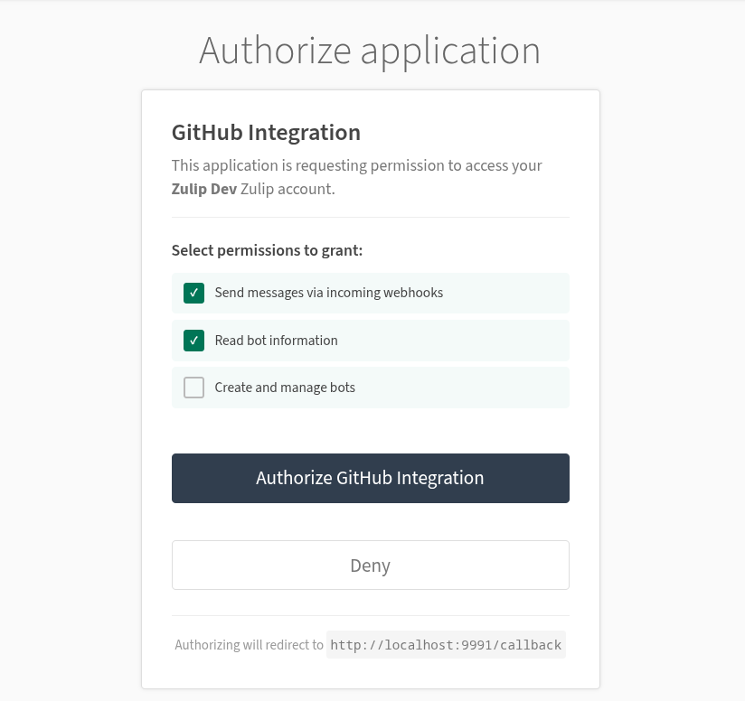

# A gist of the Problem Statement

Setting up **integrations** in Zulip can be a daunting process for non-technical users. They are redirected to the administration panel to manually create and configure bots.
Furthermore, the bot permission management lacks a user-friendly interface and a backend permissions system for managing bot permissions, making it difficult for users to grant integrations access to their Zulip data.

### Overview

1. **Backend Bot Permissions System:** Design and implement a backend permissions framework to enforce what actions integration bots can perform at runtime, not just at creation time.

2. **OAuth Authorization Flow:** Implement an OAuth system using the **Django OAuth Toolkit**, presenting users with a clear consent screen that describes exactly what an integration can access before a token is issued.

3. **UI/UX Revamp for the `/integrations` Page:** Wire up the existing bot-creation infrastructure directly to the integrations page, replacing the multi-step admin-panel redirect with a single "Add to Zulip" flow.


### Backend Bot Permissions System

**Problem:** Zulip's `INCOMING_WEBHOOK_BOT` type is documented as write-only, but this is never enforced at runtime. Once a bot has an API key, it can call any endpoint regardless of its type, a webhook bot could read messages it was without the necessary access.

**Implementation Plan**

**1. Centralized access level module — `zerver/lib/bot_permissions.py`**

Rather than scattering `is_incoming_webhook` checks throughout the codebase, bot access levels are captured in a single module. A `BotAccessLevel` enum with  *SEND_ONLY* and *READ_WRITE* value, making the permission tiers explicit. A `check_bot_can_access_endpoint()` helper raises a `JsonableError` if a *SEND_ONLY* bot attempts to reach an endpoint that hasn't been opted in to webhook access:

```python
class BotAccessLevel(IntEnum):
    SEND_ONLY = 1    # Incoming webhook bots can only send messages
    READ_WRITE = 2   # All other users/bots may have full API access

def check_bot_can_access_endpoint(user_profile: UserProfile, endpoint_allows_send_only: bool) -> None:
    """Raises JsonableError if the bot lacks permission for this endpoint."""
    if get_bot_access_level(user_profile) == BotAccessLevel.SEND_ONLY and not endpoint_allows_send_only:
        raise JsonableError(_("This API is not available to incoming webhook bots."))
```

**2. Replacing scattered checks in `zerver/decorator.py`**

There are currently two separate inline `is_incoming_webhook` guards in `validate_api_key()` and `authenticated_json_view()`. The new `get_oauth2_token_user()` introduced in the OAuth flow (see below) would add a third. All three are replaced with calls to `check_bot_can_access_endpoint()`, removing the duplication and ensuring every auth path enforces the same rule through a single code path.

The enforcement is then wired into the central dispatcher in `zerver/lib/rest.py` and documented in the OpenAPI.

**Relevant Issues**

- [#16431: Notify bot owners if bot tries to send to a channel it does not have access to](https://github.com/zulip/zulip/issues/16431)
- [#22405: Clearly document bot roles](https://github.com/zulip/zulip/issues/22405)
- [#37252: Hide disabled action buttons on bots panel for non-admins](https://github.com/zulip/zulip/issues/37252)
- [#31389: Allow changing the bot type of a bot user in the "manage bot" modal.](https://github.com/zulip/zulip/issues/31389)
---

### OAuth Authorization Flow

**Problem:** Integrations currently use API key embedded in the webhook URL `/api/v1/external/github?api_key=abc` which makes it difficult to limit its scope. The users never see or approve what the integration can do.

**Proposed OAuth flow:** The user clicks "Add to Zulip" and is redirected to a consent screen at `/oauth/authorize/` that lists what the integration can do (e.g. "Send messages via incoming webhooks"). Only after the user approves is an authorization code issued, exchanged for a scoped Bearer token, and returned as the credential in the webhook URL. Each token can be revoked independently without affecting other integrations.


**Implementation Plan**


**1. Scopes and the ZulipScopesBackend**

Django-oauth-toolkit lets you define OAuth scopes as a simple key-value list in settings.py, but Zulip needs scopes tied to its bot permission model. `ZulipScopesBackend` will extend `BaseScopes` to provide this mapping:

```python
OAUTH2_PROVIDER = {
    "SCOPES": {
        "webhook:send": "Send messages via incoming webhooks",
        "bot:read":     "Read bot information",
        "bot:write":    "Create and manage bots",
    },
    "DEFAULT_SCOPES": ["webhook:send"],
    "SCOPES_BACKEND_CLASS": "zerver.lib.oauth2_scopes.ZulipScopesBackend",
}
```

The backend is called at two points: once during authorization and then during token creation (to assign the granted scopes to the `AccessToken`). The scope names are designed to map directly to bot type restrictions from the permissions layer:

**2. Bearer Token Authentication — Extending `rest_dispatch()`**

The API request in Zulip pass through `rest_dispatch()` in `zerver/lib/rest.py`, which decides how to authenticate it. Currently If a request arrives with a Bearer token instead, it gets rejected as making the entire OAuth flow useless since the tokens it issues would never be accepted inorder to fix this.
If the `Authorization` header contains a Bearer token, route it through a new `authenticated_oauth2_api_view()` handler, otherwise fall through to the existing Basic auth path.

```python
elif request.path.startswith("/api") and "Authorization" in request.headers:
    auth_type = request.headers["Authorization"].split(None, 1)[0].lower()
    if auth_type == "bearer":
        target_function = authenticated_oauth2_api_view(...)(target_function)
    else:
        target_function = authenticated_rest_api_view(...)(target_function)
```

**3. Authorization Consent Screen**

The consent screen extends Zulip's `portico.html` base template so it inherits the standard page chrome. It shows the requesting application's name, all available scopes as checkboxes (with requested scopes pre-checked), and Authorize/Deny buttons. The user can selectively grant permissions before authorizing. A custom `ZulipAuthorizationView` overrides the default to pass the full scopes dictionary to the template.



**Per-Endpoint Scope Enforcement**

The prototype grants scopes and attaches them to tokens, to enforce them per-endpoint. The implementation extends the `view_flags` system already used by `rest_dispatch()` (e.g., `allow_incoming_webhooks`) to carry scope requirements:

```python
# In urls.py — scope requirements declared alongside routes
rest_path(
    "messages",
    POST=(send_message_backend, {"allow_incoming_webhooks", "oauth_scopes:webhook:send"}),
    GET=(get_messages_backend, {"oauth_scopes:bot:read"}),
),
```

This approach keeps scope policy in the URL routing layer where it's auditable in one place, avoids modifying every view function, and follows the same pattern Zulip already uses for `allow_incoming_webhooks`.


**Relevant Issues**

- [#17042: feature request: Make Zulip an OAuth Provider.](https://github.com/zulip/zulip/issues/17042)
- [#452: Support for OAuth2 token authentication for API?](https://github.com/zulip/zulip/issues/452)
- [#38149: Add Discord as an OAuth provider](https://github.com/zulip/zulip/issues/38149)
- [#12803: Allow revoking OAuth login](https://github.com/zulip/zulip/issues/12803)

---

### UI/UX Revamp for the `/integrations` Page


**Problem:** Every integration's setup page opens with instructions to navigate to Settings → Bots, create a bot manually, copy the API key, and return. The infrastructure for bot creation `POST /json/bots` handles creation and `can_create_incoming_webhooks()` already checks the right permissions — none of it is wired to the integrations page. This directly addresses issues [#9815](https://github.com/zulip/zulip/issues/9815) and [#692](https://github.com/zulip/zulip/issues/692).

Issue [#30139](https://github.com/zulip/zulip/issues/30139) (auto-populate bot avatar) is also related, the "Add to Zulip" flow handles this naturally since the integration is already known from context, so the avatar assigns automatically without an extra selector.


**Plan**

The full flow from button click to a ready-to-use webhook URL:

```
"Add to Zulip" button (doc.html)
    → Stream picker modal (add_to_zulip_modal.hbs)
        → POST /json/bots  [bot_type=INCOMING_WEBHOOK_BOT, avatar=integration logo]
            → integration_url_modal.ts  [pre-filled with new bot's API key + stream]
```

- `zerver/views/documentation.py` passes a `user_can_create_webhook` flag to the integration doc template, derived from existing group-based permission checks.

!!! note
    The button will only be rendered server-side for users who can act on it. Unauthenticated visitors will see a sign-in prompt instead.


**Relevant Issues**

- [#30139: Auto populate bot avatar for webhook integrations bot](https://github.com/zulip/zulip/issues/30139)
- [#36564: Improve "Generate integration URL" modal's "Topic" field.](https://github.com/zulip/zulip/issues/36564)
- [#33788: Add "copy" button to URL in "Generate URL for an integration" modal](https://github.com/zulip/zulip/issues/33788)

---
<!-- 
## Customizable Webhook Notification Fields

### Problem

Zulip's incoming webhook integrations display a fixed set of fields in
notifications. For example, when a Jira issue is created, only
**Priority** and **Assignee** are shown and users cannot choose to see
**Project**, **Version**, **Reporter**, or custom Jira fields without
editing the webhook handler code.

### Goal

Allow users to configure which fields appear in webhook notifications
through the existing "Generate URL for an integration" modal, using a
pill-based UI with typeahead suggestions. The solution should be generic
enough that other integrations (GitHub, GitLab, PagerDuty, etc.) can
adopt the same pattern.

---

### Architecture Overview

The implementation spans four layers:

```
┌─────────────────────────────────────────────────┐
│  Frontend: Pill UI + Typeahead                  │
│  (integration_url_modal.ts,                     │
│   integration_field_pill.ts)                    │
├─────────────────────────────────────────────────┤
│  Data Transport: WebhookUrlOption.options        │
│  (events.py → state_data.ts)                    │
├─────────────────────────────────────────────────┤
│  Integration Registry                           │
│  (integrations.py, webhooks/common.py)          │
├─────────────────────────────────────────────────┤
│  Webhook Handler: Field Resolution              │
│  (e.g., zerver/webhooks/jira/view.py)           │
└─────────────────────────────────────────────────┘
```

---

### Commit 1: Backend — Configurable fields for Jira issue creation

**Files:** `zerver/webhooks/jira/view.py`, `zerver/webhooks/jira/tests.py`,
`zerver/webhooks/jira/fixtures/created_with_versions_v1.json`,
`zerver/lib/integrations.py`, `zerver/webhooks/jira/doc.md`

**What changes:**

- Define an `ISSUE_FIELDS_CONFIG` dictionary that maps short field names
  (`priority`, `assignee`, `project`, `version`, `status`, `reporter`,
  `issuetype`, `description`) to tuples of `(json_path_keys, label,
  default_value)`.

- Add a `created_issue_fields` URL parameter to the Jira webhook
  endpoint (default: `"priority,assignee"`), accepted as a
  comma-separated string.

- Refactor `handle_created_issue_event` from hardcoded Priority/Assignee
  bullets to a data-driven loop over `ISSUE_FIELDS_CONFIG`.

- Update `get_in()` type signature from `list[str]` to `list[str | int]`
  to support integer indexing (needed for `fixVersions[0].name`).

- Remove `handle_created_issue_event` from `JIRA_CONTENT_FUNCTION_MAPPER`
  (set to `None`) since it now takes an extra parameter; handle it
  directly in `api_jira_webhook`.

- Register a `WebhookUrlOption` for `created_issue_fields` on the Jira
  integration in `integrations.py`.

- Fall back to default fields when no valid field names are provided.

**Tests added:**

- `test_created_with_invalid_fields_falls_back_to_default` — garbage
  field names produce the default (priority + assignee) output.
- `test_created_with_custom_fields_missing_version` — requesting
  `project,version` on a payload with empty `fixVersions` shows only
  Project.
- `test_created_with_custom_fields` — requesting `project,version` on a
  payload with populated `fixVersions` shows both.

**New fixture:** `created_with_versions_v1.json` — clone of `created_v1`
with a populated `fixVersions` array.

---

### Commit 2: Backend — Custom dot-path field support

**Files:** `zerver/webhooks/jira/view.py`, `zerver/webhooks/jira/tests.py`

**What changes:**

- Add `get_custom_field_bullet(payload, field_path)` that resolves
  arbitrary dot-separated paths (e.g., `project.name`,
  `customfield_10042.name`) against `issue.fields` in the Jira payload.
  Numeric path segments are treated as list indices.

- Update the field resolution loop in `handle_created_issue_event` to try
  `ISSUE_FIELDS_CONFIG` first, then fall back to dot-path resolution for
  fields containing a `.`. Falls back to defaults only when *no* field
  (whitelisted or dot-path) produces output.

- The last segment of the dot-path is used as the display label,
  title-cased with underscores replaced by spaces.

**Tests added:**

- `test_created_with_custom_dot_path_field` — `project.name` resolves
  correctly.
- `test_created_with_mixed_whitelisted_and_dot_path_fields` —
  `priority,project.name` combines both resolution strategies.

---

### Commit 3: Infrastructure — `options` field on `WebhookUrlOption`

**Files:** `zerver/lib/webhooks/common.py`, `zerver/lib/integrations.py`,
`zerver/lib/events.py`, `web/src/state_data.ts`,
`web/src/integration_url_modal.ts`

**What changes:**

- Add `options: list[str] | None = None` to the `WebhookUrlOption`
  dataclass. This carries predefined choices that the frontend renders
  as typeahead suggestions.

- Update Jira's `WebhookUrlOption` in `integrations.py` to include the
  eight supported field names in `options`.

- Update the backend serialization in `events.py` to pass `options` to
  the frontend when present (using conditional dict unpacking).

- Update the Zod schema in `state_data.ts` and the `UrlOption` type /
  `url_option_schema` in `integration_url_modal.ts` to accept the
  optional `options` field.

**Design decision:** `options` is optional and `None` by default, so
existing integrations are unaffected. The URL encoding remains a
comma-separated string — backward compatible with manually constructed
URLs.

---

### Commit 4: Frontend — Pill-based UI with typeahead

**Files:** `web/src/integration_field_pill.ts` (new),
`web/templates/settings/generate_integration_url_config_pills_modal.hbs`
(new), `web/src/integration_url_modal.ts`,
`web/templates/settings/generate_integration_url_modal.hbs`

**What changes:**

- **`integration_field_pill.ts`** — New module following the
  `integration_branch_pill.ts` pattern:
  - Defines `FieldPill` type (`{type: "field", field_name: string}`).
  - `create_pills()` creates the pill container using `input_pill.create`.
  - `set_up_typeahead()` wires up `Typeahead` from
    `bootstrap_typeahead.ts` on the pill input. The source function
    filters out already-selected fields, so the typeahead only suggests
    options not yet added. Users can also type custom dot-path strings
    and press Enter to create pills.

- **`generate_integration_url_config_pills_modal.hbs`** — Minimal
  template: a label and a `div.pill-container` with a contenteditable
  input. No `<select>` dropdown — the typeahead handles suggestions.

- **`integration_url_modal.ts`** changes:
  - Imports the new field pill module and template.
  - Maintains a `Map<string, FieldPillWidget>` for pill widgets.
  - In `render_url_options()`: when `option.options` is present, renders
    the pill template, creates a pill widget, sets up typeahead, and
    pre-populates with defaults (`priority`, `assignee` for Jira).
  - In `update_url()`: reads pill items and joins with commas for the
    URL parameter.
  - In `reset_to_blank_state()`: clears the pill widgets map.

- **Visibility toggle:** The config options container starts hidden
  (`class="hide"`) and is shown/hidden together with the events filter
  checkbox ("Filter events that will trigger notifications?").

**UI behavior:**

- Clicking in the pill container shows typeahead suggestions from the
  predefined options (minus already-selected ones).
- Typing filters the suggestions; pressing Enter or clicking a
  suggestion adds a pill.
- Custom dot-path strings (e.g., `customfield_10042.name`) can be typed
  directly and added as pills.
- Clicking × on a pill removes it.
- The URL updates live as pills are added/removed.

---

### Commit 5: Documentation update

**Files:** `zerver/webhooks/jira/doc.md`

**What changes:**

- Documents the pill-based field selector in the URL generation modal.
- Documents custom dot-path notation for Jira custom fields.
- Removes the manual URL-parameter example (now handled by the UI).

---

### Files Touched

| File | Change |
|------|--------|
| `zerver/webhooks/jira/view.py` | `ISSUE_FIELDS_CONFIG`, `get_custom_field_bullet`, refactored field loop |
| `zerver/webhooks/jira/tests.py` | 5 new test methods |
| `zerver/webhooks/jira/fixtures/created_with_versions_v1.json` | New fixture |
| `zerver/webhooks/jira/doc.md` | Updated docs |
| `zerver/lib/webhooks/common.py` | `options` field on `WebhookUrlOption` |
| `zerver/lib/integrations.py` | Jira `url_options` with `options` list |
| `zerver/lib/events.py` | Serialize `options` to frontend |
| `web/src/state_data.ts` | Schema update for `options` |
| `web/src/integration_field_pill.ts` | New pill module with typeahead |
| `web/src/integration_url_modal.ts` | Pill rendering, URL building, visibility toggle |
| `web/templates/settings/generate_integration_url_config_pills_modal.hbs` | New pill template |
| `web/templates/settings/generate_integration_url_modal.hbs` | Config container starts hidden |

### Future Extensibility

The `options` field on `WebhookUrlOption` is generic — any integration
can adopt it. Potential candidates:

- **GitHub/GitLab:** Configurable fields for issue/PR notifications
  (labels, milestone, reviewers, etc.)
- **PagerDuty:** Choose which incident fields to display
- **Sentry:** Select error context fields

Each integration would define its own `FIELDS_CONFIG` dict and add
`options=` to its `WebhookUrlOption` — no framework changes needed.
 -->
